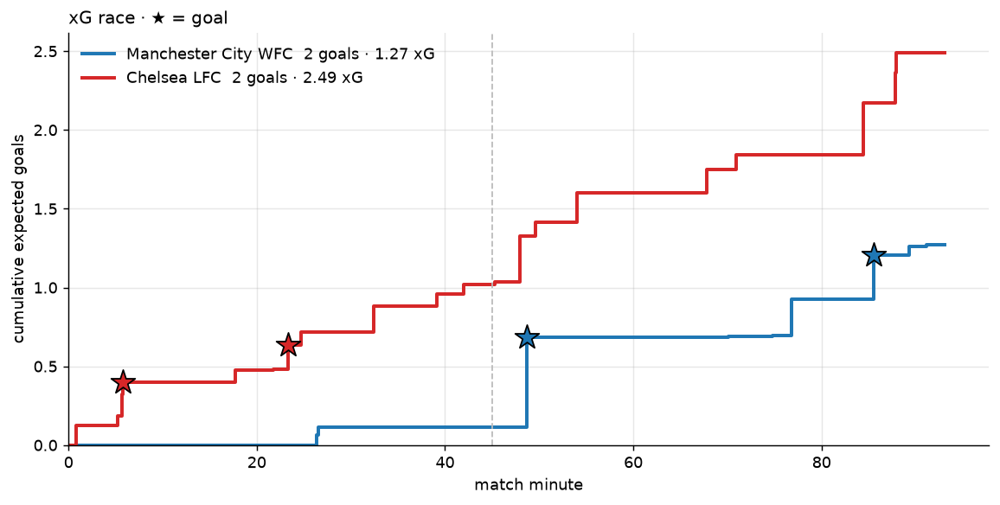
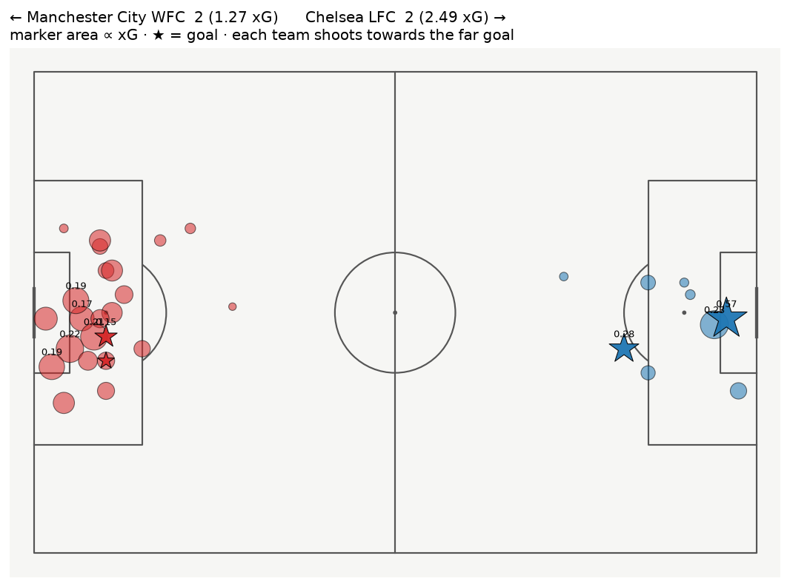
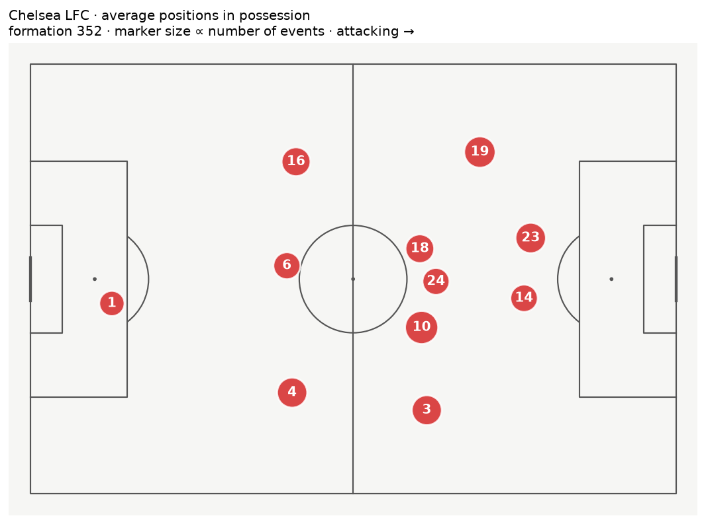
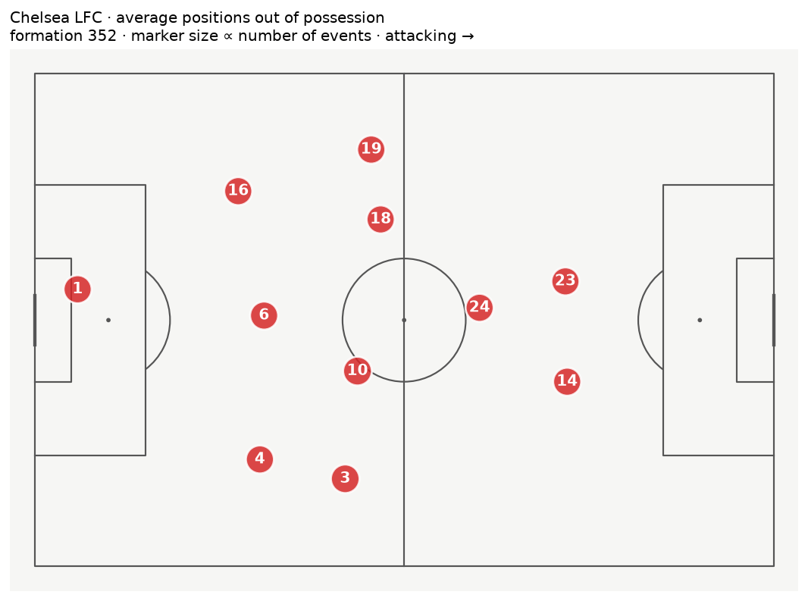
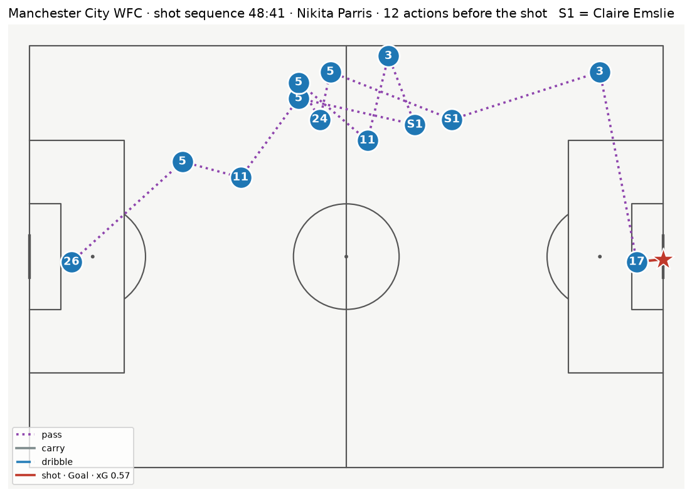
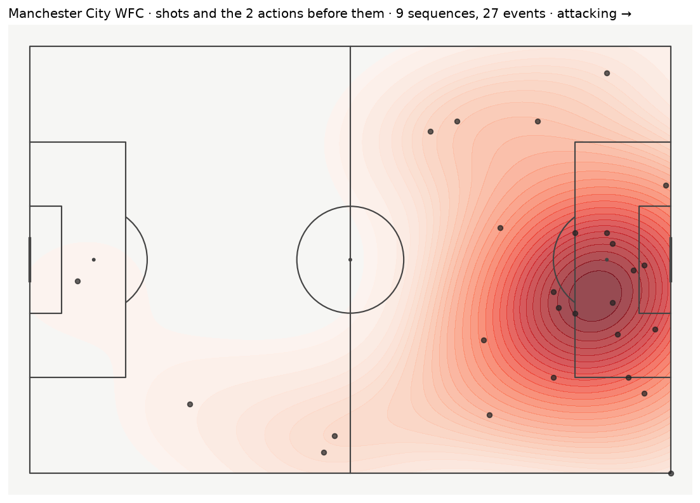
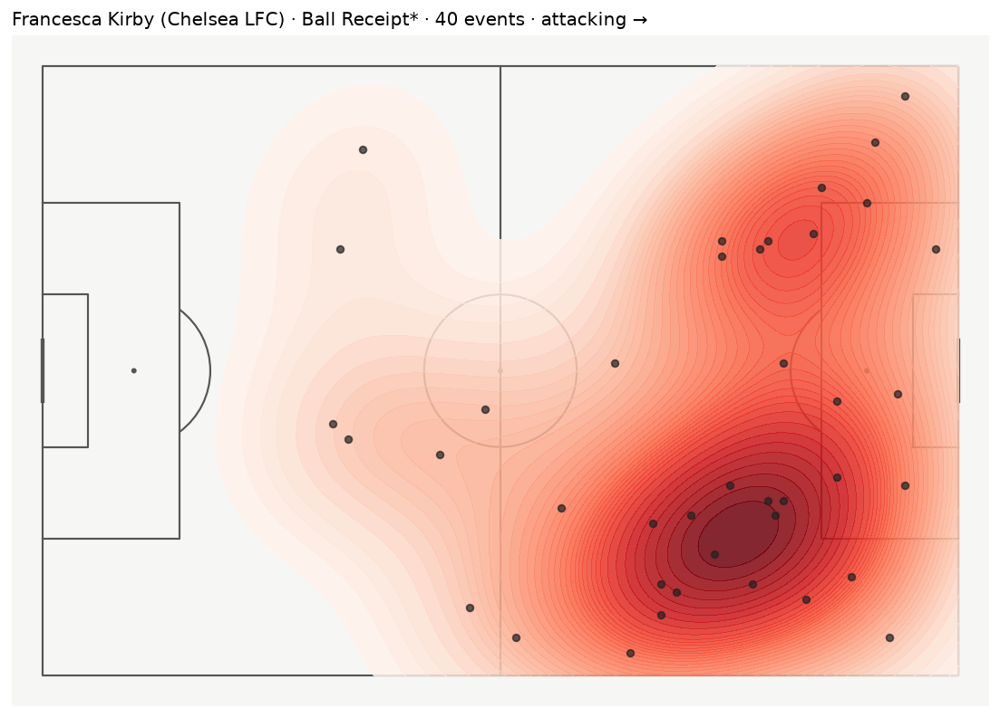
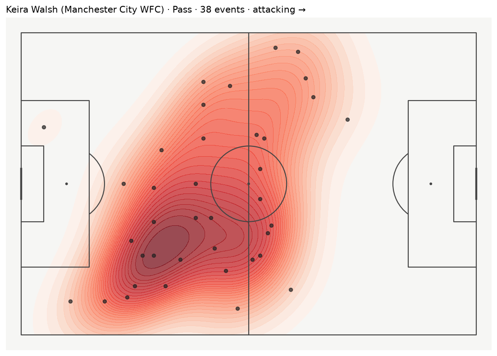

# footviz

[](https://github.com/specialone0007/footballDataVisualization/actions/workflows/ci.yml)


Match-level football visualisations from **StatsBomb event data**: xG race, xG shot map,
average positions in and out of possession, per-player action heatmaps, shot sequences with
build-up, and where a team's chances were created. One Python package, one CLI, tested on a
bundled FA WSL match.

Started as a Sabancı University CS543 (Data Visualization) project in 2022, a Flask server
feeding PNGs to a Windows Forms client. Rewritten in 2026 as a library with
[mplsoccer](https://mplsoccer.readthedocs.io) pitches; the original code and report are kept
in [`legacy/`](legacy/) and [`docs/legacy/`](docs/legacy/).

| xG race | xG shot map |
|---|---|
|  |  |

| Average positions, in possession | Average positions, out of possession |
|---|---|
|  |  |

| Shot sequence (goal, 48:41) | Where the chances came from |
|---|---|
|  |  |

| Player heatmap: ball receipts | Player heatmap: passes |
|---|---|
|  |  |

Bundled match: Manchester City WFC 2–2 Chelsea, FA Women's Super League 2018/19, from the
StatsBomb open-data snapshot the 2022 project used (2,960 events, 33 shots with xG).

## Install and run

```bash
pip install -e ".[dev]"
pytest                                                    # 15 tests, ~10 s

footviz info   data/mancity-chelsea-fawsl-2018-19.json    # teams, score, xG, lineups
footviz shots  data/mancity-chelsea-fawsl-2018-19.json    # every shot with its build-up chain
footviz render data/mancity-chelsea-fawsl-2018-19.json --out figures
footviz render data/mancity-chelsea-fawsl-2018-19.json --out figures \
       --heatmaps Pass "Ball Receipt*" Pressure           # + per-player heatmaps (105 PNGs)

footviz fetch 3775576 --out data/3775576.json             # any match from StatsBomb open data
```

`footviz shots` output, after the fix described below:

```
[ 2] Chelsea LFC          05:41 So-yun Ji · Blocked · xG 0.02
      build-up: Ramona Bachmann (Pass)
[ 3] Chelsea LFC          05:43 Drew Spence · Blocked · xG 0.11
      build-up: (none)
[ 4] Chelsea LFC          05:46 Millie Bright · Goal · xG 0.08
      build-up: Anita Amma Ankyewah Asante (Pass)
```

From Python:

```python
from footviz import Match, load_events, shot_sequences, plots

m = Match(load_events("data/mancity-chelsea-fawsl-2018-19.json"))
m.score(), m.xg()                       # {'Manchester City WFC': 2, 'Chelsea LFC': 2}, {...: 1.27, ...: 2.49}
seqs = shot_sequences(m)
fig = plots.shot_sequence(m, seqs[18])  # Parris' goal
fig.savefig("parris.png", dpi=150, bbox_inches="tight")
```

## What each view shows

- **xG race** (`plots.xg_timeline`). Cumulative expected goals per team over the match clock,
  goals as stars. Chelsea generated twice City's xG and drew.
- **xG shot map** (`plots.xg_shot_map`). Every shot at its location, area ∝ xG, second team
  mirrored so each attacks the far goal. City's equaliser (0.57) was the best chance of the
  game.
- **Average positions** (`plots.average_positions`). Mean event location per starter, split
  by whether the team had the ball. Marker size ∝ number of events.
- **Action heatmap** (`plots.action_heatmap`). KDE + points for one player and one event type.
- **Shot sequence** (`plots.shot_sequence`). The chain of passes, carries and dribbles by the
  shooting team from the start of the possession (or the previous shot) to the shot, numbered
  by shirt; substitutes appear as S1, S2.
- **Key actions** (`plots.key_actions_heatmap`). Density of shots plus the two on-ball actions
  before each, per team: where chances were created rather than where the ball was.

## Layout

```
src/footviz/
  match.py       load/fetch events; Match: teams, lineups, shots, average positions, clock
  sequences.py   shot_sequences(): build-up chain per shot; roles Shot / Assist / Build-up
  plots.py       the six figures (mplsoccer, StatsBomb coordinates)
  cli.py         footviz info | shots | render | fetch
tests/           15 tests against the bundled match
data/            one StatsBomb open-data match (see licence note)
docs/figures/    the PNGs shown above
docs/legacy/     2022 report (PDF)
legacy/          2022 Flask server + WinForms GUI sources, unchanged (build artefacts removed)
```

## Latest improvements (2026 rewrite)

- **Sharper shot sequences.** A sequence now starts at the previous shot by the same team, so
  a rebound three seconds after a blocked shot is its own sequence with its own build-up rather
  than repeating the first one. Carry events (present in current StatsBomb files) are part of
  the chain.
- **Roles per player.** `ShotSequence.role_of` labels each participant Shot / Assist /
  Build-up on the bounded chain, and `involvement()` lists every chance a player took part in.
- **Any match, any machine.** The loader takes any StatsBomb events file or fetches one by id
  from open data; no absolute paths, no cached PNGs, no hard-coded team names.
- **Library first.** Every plot returns a `Figure` for notebooks; the CLI renders the whole set
  in one command; mplsoccer pitches replace hand-drawn lines.
- **Tested and CI-checked**: 15 tests on the bundled match plus a full render on every push.

## Data licence

The bundled match file is from [StatsBomb open data](https://github.com/statsbomb/open-data)
and is redistributed under the
[StatsBomb Public Data User Agreement](https://github.com/statsbomb/open-data/blob/master/LICENSE.pdf):
non-commercial use with attribution. Code in this repository is MIT.

## License

MIT. 2022 project by Furkan Reha Tutaş (CS543, Sabancı University); 2026 rewrite by the same.
